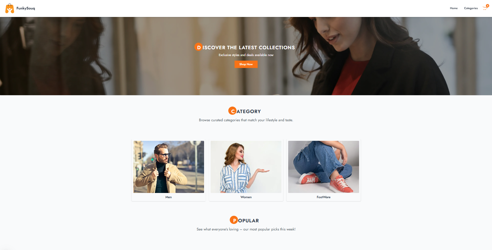

# Welcome to FunkySouq Lite 🛒

## 🌟 A Stylish E-Commerce Web App Built with Next.js


---

## 🔥 Features

- Product detail pages with dynamic size selection
- Cart management with quantity handling (using Zustand)
- Real-time toast notifications with `react-hot-toast`
- Smooth animations via Framer Motion
- Fully responsive layout using Tailwind CSS
- Refered Original FunkySouq Website for inspiration

---

## 📀 Screenshots

| Home Page                              | Product Page                                 | Cart Page                              |
| -------------------------------------- | -------------------------------------------- | -------------------------------------- |
|  |  |  |

---

## 🚀 Live Demo

👉 [Click Here to Visit the Live Site](https://sample-ecommerce-gamma.vercel.app/)

---

## 🛠️ Tech Stack

- **Framework**: [Next.js](https://nextjs.org/)
- **Styling**: [Tailwind CSS](https://tailwindcss.com/)
- **State Management**: [Zustand](https://zustand-demo.pmnd.rs/)
- **Animations**: [Framer Motion](https://www.framer.com/motion/)
- **Notifications**: [React Hot Toast](https://react-hot-toast.com/)

---

## ⚙️ Getting Started

### 1. Clone the Repository

```bash
git clone https://github.com/shefeenaes/sampleEcommerce.git
cd sampleEcommerce
```

### 2. Install Dependencies

```bash
npm install
# or
yarn install
```

### 3. Run the Development Server

```bash
npm run dev
# or
yarn dev
```

Then open [http://localhost:3000](http://localhost:3000) in your browser.

---

## 📁 Project Structure

```plaintext
sampleEcommerce/
├── app/              # Next.js app
├── components/       # UI components
├── data/             # data used
├── public/           # Static assets
├── store/            # Zustand cart store
└── utils/            # Helper functions (if any)
```

---

## 📬 Contact

- **Email**: shefeena.e.s@gmail.com
- **LinkedIn**: [linkedin.com/in/shefeena-e-s-320017157](www.linkedin.com/in/shefeena-e-s-320017157)
